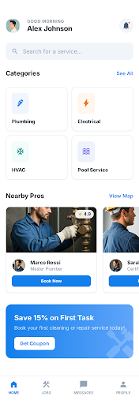
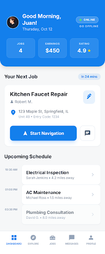

# Fuerza Home Services

**Fuerza Home Services** is an on-demand home services platform that connects customers with skilled technicians (plumbers, electricians, pool techs, cleaning) in real time. Think of it as an Uber-style experience for home repairs — customers request help, nearby technicians accept the job, and everything is tracked live on a map. Fully bilingual (English / Spanish).

---

## ✨ Features

### 📱 Mobile App (Customer)
- **Map-first experience** — see your location and nearby online technicians in real time
- **Trade filters** — filter map markers by trade (Plumber, Electrician, Pool, Cleaning) with color-coded pins
- **Service request form** — select a trade, enter address, describe the issue, and attach up to 5 photos
- **Photo auto-compression** — photos are resized (800px) and compressed (0.6 quality) on-device before upload
- **Live job tracking** — watch your technician's location update on the map via WebSocket
- **Job history** — view all past and active service requests

### 🔧 Mobile App (Technician)
- **Go online / offline toggle** — control your availability
- **Real-time job alerts** — receive new job requests instantly via Socket.io
- **Spanish-speaker notifications** — get an alert when a Spanish-speaking customer creates a job, plus an "ES" badge on the job card
- **Rich job details** — see customer name, address, description, and a scrollable photo gallery before accepting
- **Accept & manage jobs** — view open requests and accept them with one tap
- **Location broadcasting** — your position streams to customers while online

### 🖥️ Admin Console (Web)
- **User management** — view all registered customers and technicians
- **Add users** — create new users directly from the dashboard
- **Edit users** — update name, email, phone, and role via a modal
- **Delete users** — remove users with cascading cleanup of linked profiles
- **System stats** — at-a-glance cards for total users, technicians, and customers

### 🌐 Internationalization (i18n)
- **English / Spanish** — full UI localization across all screens
- **Language toggle** — switch languages on Login or Profile screens (🇺🇸 / 🇪🇸)
- **Persistence** — language saved locally (AsyncStorage) and synced to backend (`preferredLanguage` on User)
- **Technician awareness** — Spanish-speaking customer badge + alert for technicians

### 🔐 Authentication
- Register with email + phone number
- Login with email or phone as identifier
- Show/hide password toggle
- JWT-based token authentication
- Role-based access control (Customer, Technician, Admin)

### ⚡ Real-Time
- Socket.io powered WebSocket connections
- Live technician location tracking (with trade info)
- Instant job status updates (Requested → Matched → En Route → Completed)
- New job alerts for technicians with Spanish-speaker detection

---

## 📂 Project Structure

```
fuerza-home-services/
├── backend/                    # Node.js / Express API + WebSocket server
│   ├── prisma/
│   │   └── schema.prisma       # Database schema (PostgreSQL)
│   ├── scripts/
│   │   ├── create-admin.ts     # Seed an admin user
│   │   ├── reset-admin-password.ts  # Reset admin password
│   │   └── user-stats.ts       # Print user statistics
│   └── src/
│       ├── controllers/        # Route handlers (auth, admin, jobs)
│       ├── middleware/          # Auth + Admin middleware
│       ├── routes/             # Express route definitions
│       ├── services/           # Socket.io service
│       ├── utils/              # Password hashing, JWT helpers
│       └── server.ts           # App entry point
│
├── mobile/                     # React Native (Expo) iOS/Android app
│   ├── app/
│   │   ├── (auth)/             # Login & Register screens
│   │   └── (tabs)/             # Home, Jobs, Profile, Request screens
│   │       └── index.tsx       # Role-based dashboard switch
│   └── src/
│       ├── components/
│       │   └── stitch_ui/      # Stitch-designed UI components
│       │       ├── HomeownerDashboard.tsx      # Customer home (Stitch 13fe14c8)
│       │       ├── TechnicianMainDashboard.tsx # Tech home (Stitch b151d673)
│       │       ├── GreetingHeader.tsx          # Shared greeting bar
│       │       ├── CategoryChip.tsx            # Trade category pill
│       │       ├── ProCard.tsx                 # Professional card
│       │       ├── PromoBanner.tsx             # Promotional banner
│       │       └── index.ts                   # Barrel exports
│       ├── constants/          # Design tokens (Colors, Typography, Spacing)
│       ├── hooks/              # Theme color hooks
│       ├── i18n/               # Translation files (en.ts, es.ts) + Zustand language store
│       ├── services/           # Axios API client, Socket client
│       └── store/              # Zustand stores (Auth, Location, Jobs, Map)
│
└── web/                        # React (Vite) Admin Dashboard
    └── src/
        ├── pages/              # Login, Dashboard
        ├── services/           # Axios API client
        └── store/              # Zustand auth store
```

---

## 🛠️ Tech Stack

| Layer        | Technology                                        |
|--------------|---------------------------------------------------|
| **Mobile**   | React Native, Expo, Expo Router, Zustand, Axios   |
| **Maps**     | react-native-maps, expo-location                  |
| **Photos**   | expo-image-picker, expo-image-manipulator          |
| **i18n**     | Custom Zustand store + AsyncStorage persistence   |
| **Real-time**| Socket.io (server) + socket.io-client (mobile)    |
| **Backend**  | Node.js, Express, TypeScript                      |
| **Database** | PostgreSQL + Prisma ORM                           |
| **Auth**     | JWT (jsonwebtoken) + bcryptjs                     |
| **Admin Web**| React, Vite, TypeScript, Zustand, Lucide Icons    |

---

## 🚀 Getting Started

### Prerequisites
- Node.js v18+
- PostgreSQL (local or Docker)
- Expo Go app (iOS/Android) for mobile testing

### 1. Backend

```bash
cd backend
npm install
# Configure .env with DATABASE_URL, JWT_SECRET, PORT
npx prisma db push
npx ts-node scripts/create-admin.ts   # Create admin user
npm run dev                            # Starts on :3000
```

### 2. Mobile App

```bash
cd mobile
npm install
# Edit src/constants/Config.ts — set API_URL to your LAN IP for physical devices
npx expo start --clear
# Scan QR code with Expo Go
```

### 3. Admin Console

```bash
cd web
npm install
npm run dev                            # Starts on :5173
# Login: admin@fuerza.com / admin
```

---

## 🔄 Workflow

### Customer Flow
1. **Register** as a Customer (email + phone)
2. **Choose Language** — toggle 🇺🇸/🇪🇸 on Login or Profile
3. **Home Screen** — view your location and nearby online technicians on the map
4. **Filter Technicians** — tap the filter button to show/hide trades (Plumber, Electrician, Pool, Cleaning)
5. **Request Service** — tap "Request a Service", select trade, enter address, describe issue, attach photos
6. **Track Job** — watch technician location in real time after they accept
7. **Job Complete** — review final status in the Jobs tab

### Technician Flow
1. **Register** as a Technician (toggle switch on registration)
2. **Go Online** — toggle availability on the Home Screen
3. **Receive Jobs** — new requests appear in the Jobs tab instantly (with Spanish-speaker alert if applicable)
4. **Review Details** — see customer name, address, description, photos, and language badge before accepting
5. **Accept & Work** — tap "Accept Job" to claim a request
6. **Status Updates** — progress through: Matched → En Route → Arrived → Working → Completed

### Admin Flow
1. **Login** at `http://localhost:5173` with admin credentials
2. **View Dashboard** — see user stats and full user table
3. **Add Users** — click "Add User" to create accounts manually
4. **Edit Users** — click the pencil icon to modify user details
5. **Delete Users** — click the trash icon to remove users (cascading deletes handle linked profiles)

---

## 📄 License

This project is for internal/private use.

---

## 🧭 Dashboard Architecture (Stitch Integrated)

The home tab renders a role-specific dashboard designed in [Google Stitch](https://stitch.google.com/) and translated into React Native components.

### 1. Customer Dashboard

| Property | Value |
|----------|-------|
| **Stitch Screen ID** | `13fe14c8311a438ca41a388dbfc71ae7` |
| **Label** | Homeowner Dashboard |
| **Dimensions** | 390 × 1134 (mobile) |
| **Route** | `app/(tabs)/index.tsx` (role-based rendering) |
| **Component** | `mobile/src/components/stitch_ui/HomeownerDashboard.tsx` |

**Description:** Primary landing experience for authenticated customers. Displays greeting header, service categories, featured professionals, and quick access to create a service request.

<p align="center">
  
</p>
### 2. Technician Dashboard

| Property | Value |
|----------|-------|
| **Stitch Screen ID** | `b151d67385da435280585ba51c0914bd` |
| **Label** | Professional Technician Main Dashboard |
| **Dimensions** | 390 × 944 (mobile) |
| **Route** | `app/(tabs)/index.tsx` (role-based rendering) |
| **Component** | `mobile/src/components/stitch_ui/TechnicianMainDashboard.tsx` |

**Description:** Primary landing experience for authenticated technicians. Displays job queue overview, service map access, earnings snapshot, and profile shortcuts.

<p align="center">
  
</p>

### Role-Based Home Tab Behavior

Expo Router's `(tabs)/index.tsx` serves as the **shared Home tab** for all authenticated users. At render time it reads `user.role` from `useAuthStore` and conditionally renders one of two Stitch-designed dashboard components:

- **`TECHNICIAN`** → renders `<TechnicianMainDashboard />`
- **`CUSTOMER` / `BOTH`** → renders `<HomeownerDashboard />`

No additional tab routes were created to preserve Expo Router structure stability. Both dashboards are pure presentational components — all data and callbacks are passed as props from `index.tsx`.
